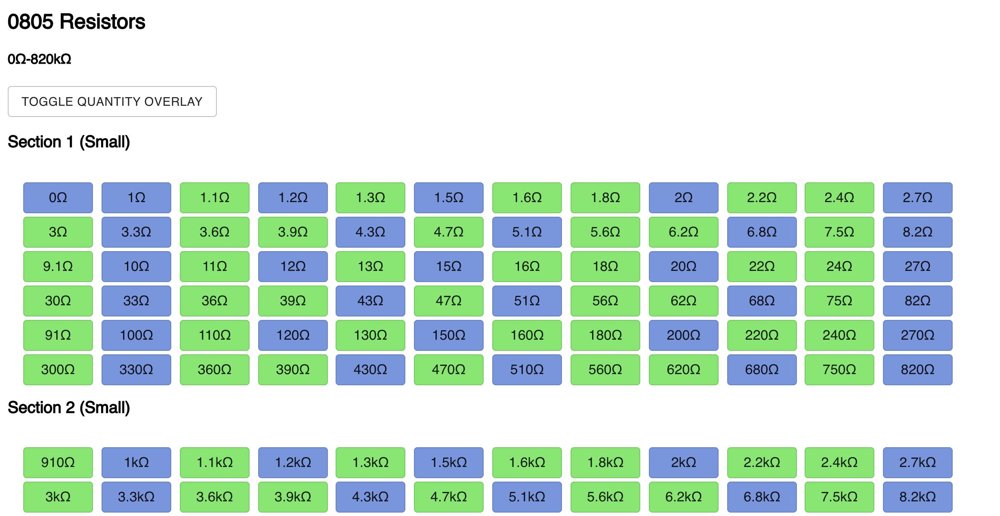
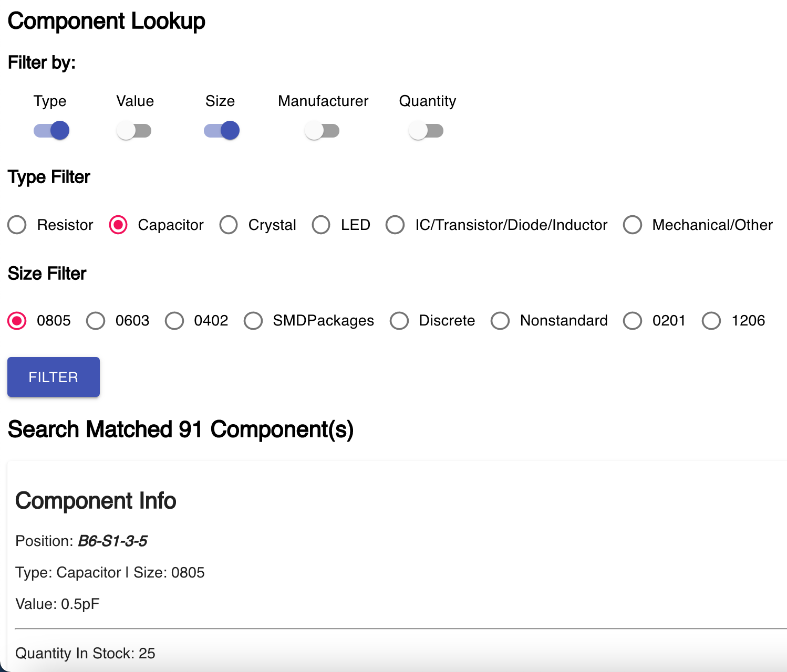
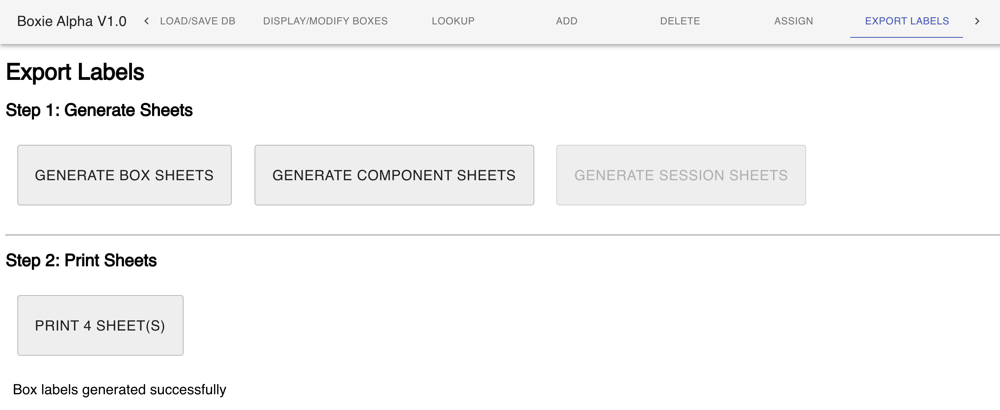

# Boxie

By Aaron Becker

### What is Boxie?

Boxie is an advanced inventory management system for my large collection of PCB surface mount components.

Features:
- Eagle PCB designer BOM support - can find and decrement components from store
- "Box" and "Component" system - flexible yet easy to understand
- Item information and lookup to find whatever you need quickly
- Easy label generation and export for printing
- Clean UI

## Project Intent

Last year, as I became more and more interested in building circuit boards, I ended up ordering a lot of Digikey and Mouser parts. With a disorganized collection, more and more frequently I noticed that things would get lost or I would over. Boxie aims to solve this problem by letting me organize all of my components carefully while taking away much of the difficulty in manual organization.

## Screenshots

### Box View and Management

Colors represent quantity in stock, can drag components to change box order

### Component Lookup

Configurable lookup allows searching by many parameters

### Label Export

Easy label generation for printing allows quick turnaround to add another box or component to collection

